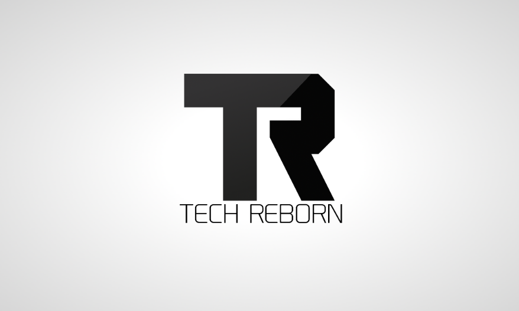

# Welcome to the Tech Reborn Wiki

## 🚧 Wiki Migration in Progress

The documentation wiki is currently undergoing a migration from dokuwiki to mkdocs. Some pages may not be formed correctly, and some links may be broken.

🛠️ **We welcome contributions!** If you'd like to help out, head over to our [GitHub repository](https://github.com/TechReborn/Wiki) and get involved.

---

{.align-right width="512" query="?512"}

**Tech Reborn** is a completely standalone tech mod including tools and machines to gather resources, process materials, and progress through the mod.

Take a look at **[Getting Started](/Getting Started)** for help with the basics of the mod.

---

## Downloads

Tech Reborn can be downloaded from:

- **[CurseForge](https://minecraft.curseforge.com/projects/techreborn)**
- **[GitHub](https://github.com/TechReborn/TechReborn/releases)**

***Versions below 1.17 also require [Reborn Core](https://www.curseforge.com/minecraft/mc-mods/reborncore) to be installed separately***\
*1.17+ has this included*

Other mods by members of the Tech Reborn team can be found **[on the TR Homepage](https://techreborn.ovh)**

---

## Issues and Suggestions

To report an issue or make a suggestion, please head up to the **[Issue Tracker](https://github.com/TechReborn/TechReborn/issues)** , and open a **new issue**. You will need a **[GitHub](https://github.com/)** account for this (but calm, it's fast and free to get one ;-)).

\<callout type="warning" icon="true" title="Issue Reports"\>It is **very important** that you include the *Tech Reborn **version number*** in your issue report.\</callout\>

If you want personal help feel free to join our **[Discord Server](https://discord.gg/teamreborn)** 8-) to ask questions, or just keep up with news from **Team Reborn**.

---